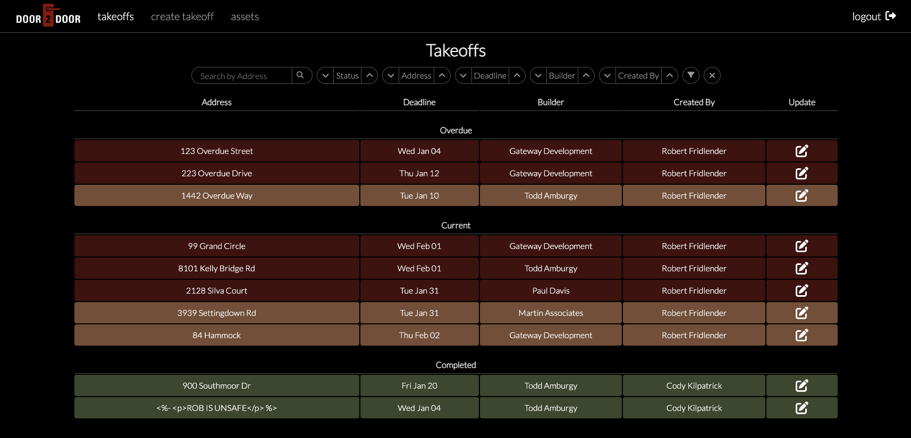
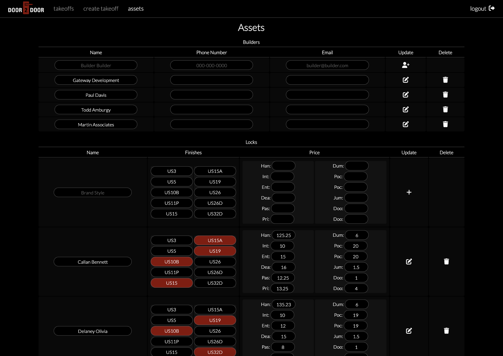

## [takeOff](https://takeoff.fly.dev/)

*takeOff* is an app dedicated to optimizing the workflow of Door2Door Builder Services, a subcontracting business in the construction industry dedicated to providing a variety of installation services to builders in remodeling and new construction. The process of providing these services begins by going to a potential builder's jobsite to record a takeoff, a list of materials necessary to complete a job. This takeoff is initially used to create an estimate for a potential builder, used for reference when gathering the materials for the job to send out with the installer, and lastly, used to create a bill for the builder once the job is completed. The takeoff is a mutable document which connects every step of the construction process. 

Prior to the development of *takeOff*, Door2Door was forced to transcribe a takeoff to a different medium throughout every step of the construction process. The takeoff began in written form while walking the jobsite. It would then be transcribed to a locally-stored spreadsheet for recordkeeping, where the owners would add notes and updates on the job's progress. Lasty, it would then be transcribed in the form of a bill into Quickbooks to be sent to the builder.

*takeOff* is a simple yet versatile solution to this problem. With *takeOff*, a takeoff can be recorded through the use of a mobile device while walking the jobsite, and that takeoff is now available for all owners and employees to view in order to carry out their step of the process, without the need for unnecessary and often ineffective communication.

## [Visit the app here](https://takeoff.fly.dev/)

## [View the planning materials here](https://trello.com/b/5nzGqCBG/takeoff-planning-materials)

## Technologies Used

Others: Google OAuth 2.0, EJS, Mongoose

## Icebox

- [ ] Create customer-facing portfolio website, displaying available products and services
- [ ] Allow managers to attach notes when editing a takeoff
- [ ] Allow employees to record takeoffs for other services
- [ ] Allow employees to see which jobs they have been assigned to in profile page
- [ ] Allow owners to export a spreatsheet of each takeoff to send as a bill
- [ ] Allow builders to visit the app to record their own takeoff
- [ ] Optimize user experience when using a phone